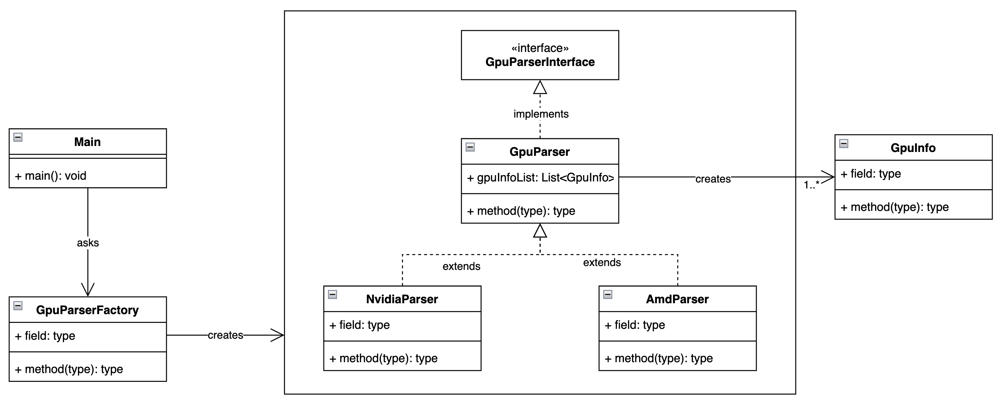

# gpu-parser



## 1. Setup environment

### 1.1 Mac
```
export JAVA_HOME=/Library/Java/JavaVirtualMachines/jdk1.8.0_144.jdk/Contents/Home
```

## 2. Build
```
./gradlew clean build
```

## 3. Run
```
java -jar build/libs/gpu-parser-0.1.0.jar
```
